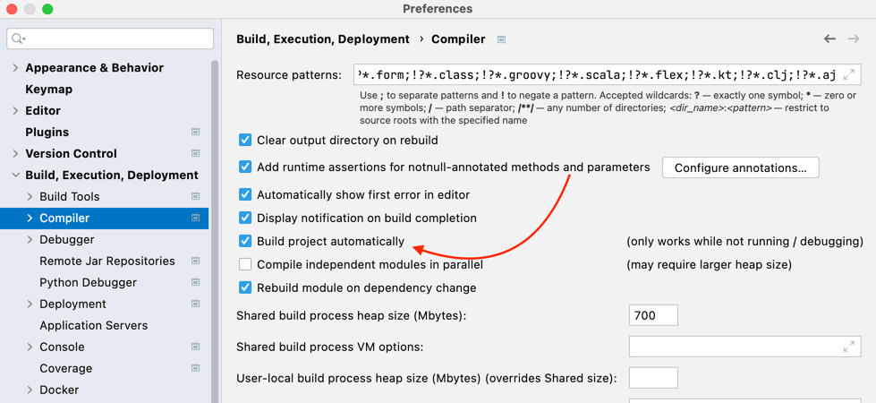
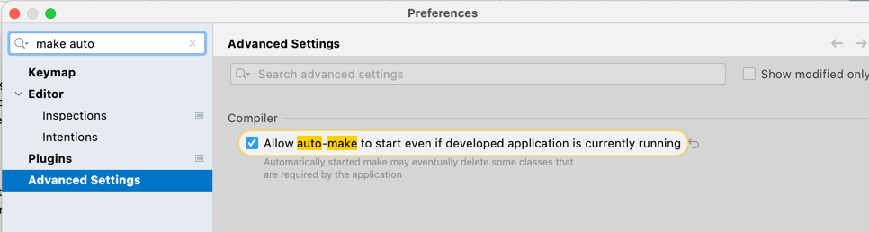
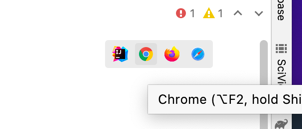

To work seamlessly with thymeleaf do this

auto-reload pages ->
click on browser icon on top right corner of html page code in intellij

https://www.jetbrains.com/help/idea/compiling-applications.html#auto-build
